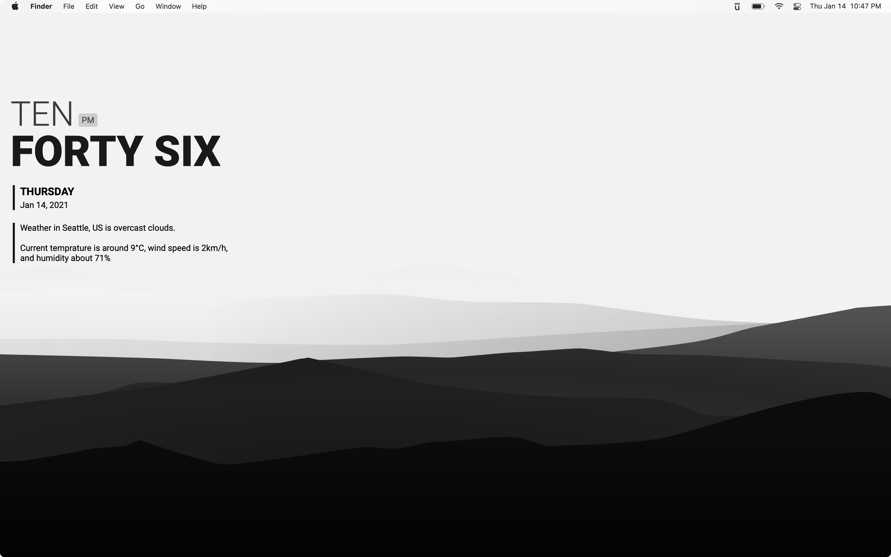

# ÜbersichtWidgets

Custom widgets for [Übersicht](https://tracesof.net/uebersicht/)

## Installation

1. Clone this repo to a local directory
2. `cd` into this directoy and run `npm install`
3. Set this directoy as the source for widgets in Übersicht preferences.
4. Pick the widget you want to display, hide the others.

## Widgets 

### Lynx

A simple text clock with weather information.

